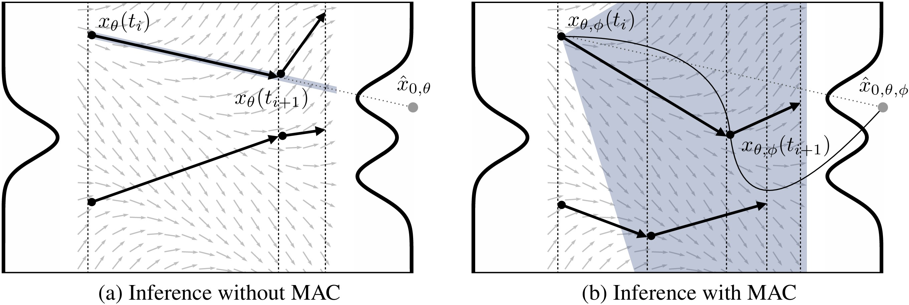

## Multidimensional Adaptive Coefficient for Inference Trajectory Optimization in Flow and Diffusion (MAC)<br><sub>Official PyTorch implementation of the ICML 2025 paper</sub>



**Multidimensional Adaptive Coefficient for Inference Trajectory Optimization in Flow and Diffusion**<br>
Dohoon Lee, Jaehyun Park, Hyunwoo J. Kim, Kyogu Lee
<br>https://arxiv.org/abs/2404.14161<br>

Abstract: *Flow and diffusion models have demonstrated strong performance and training stability across various tasks but lack two critical properties of simulation-based methods: freedom of dimensionality and adaptability to different inference trajectories. To address this limitation, we propose the Multidimensional Adaptive Coefficient (MAC), a plug-in module for flow and diffusion models that extends conventional unidimensional coefficients to multidimensional ones and enables inference trajectory-wise adaptation. MAC is trained via simulation-based feedback through adversarial refinement. Empirical results across diverse frameworks and datasets demonstrate that MAC enhances generative quality with high training efficiency. Consequently, our work offers a new perspective on inference trajectory optimality, encouraging future research to move beyond vector field design and to leverage training-efficient, simulation-based optimization.*

## Requirements

- **OS**: Linux and Windows are supported, but **Linux is recommended** for better performance and compatibility.
- **Hardware**:
  - At least one high-end NVIDIA GPU is required for sampling.
  - 8 GPUs are recommended for training.
  - All development and testing were done on **RTX 3080Ti**, **RTX 4090**, and **RTX A6000**.

- **Docker Setup** (Recommended):
  ```bash
  # 1. Pull the base PyTorch image
  docker pull pytorch/pytorch:2.7.0-cuda11.8-cudnn9-devel

  # 2. Run a container (replace <container_name> and <project_dir>)
  docker run -dti --gpus all --workdir /workspace \
      -v <project_dir>:/workspace \
      --name <container_name> \
      pytorch/pytorch:2.7.0-cuda11.8-cudnn9-devel

  # 3. Exec into the container
  docker exec -it <container_name> /bin/bash

  # 4. Inside the container, install required Python packages
  pip install dill==0.4.0 \
              ftfy==6.3.1 \
              natsort==8.4.0 \
              ninja==1.10.2 \
              numpy==1.26.4 \
              opencv-python==4.11.0.86 \
              regex==2024.11.6 \
              scipy==1.15.3 \
              timm==0.5.4 \
              wandb==0.16.6

  # 5. Install additional system libraries
  apt-get update && apt-get install -y libgl1-mesa-glx libglib2.0-0

## Pre-Trained Model

 [**ImageNet-64 (EDM<sub>α</sub> + adv θ, φ)**](https://drive.google.com/file/d/1kAJJ-Q47ttc_hj067ZXkfpAnuUPD9b8m/view?usp=sharing)


## Dataset

**CIFAR-10:** Download the [CIFAR-10 python version](https://www.cs.toronto.edu/~kriz/cifar.html) and convert to ZIP archive:

```.bash
python dataset_tool.py --source=downloads/cifar10/cifar-10-python.tar.gz \
    --dest=datasets/cifar10-32x32.zip
```

**FFHQ:** Download the [Flickr-Faces-HQ dataset](https://github.com/NVlabs/ffhq-dataset) as 1024x1024 images and convert to ZIP archive at 64x64 resolution:

```.bash
python dataset_tool.py --source=downloads/ffhq/images1024x1024 \
    --dest=datasets/ffhq-64x64.zip --resolution=64x64
```

**AFHQv2:** Download the updated [Animal Faces-HQ dataset](https://github.com/clovaai/stargan-v2/blob/master/README.md#animal-faces-hq-dataset-afhq) (`afhq-v2-dataset`) and convert to ZIP archive at 64x64 resolution:

```.bash
python dataset_tool.py --source=downloads/afhqv2 \
    --dest=datasets/afhqv2-64x64.zip --resolution=64x64
```

**ImageNet:** Download the [ImageNet Object Localization Challenge](https://www.kaggle.com/competitions/imagenet-object-localization-challenge/data) and convert to ZIP archive at 64x64 resolution:

```.bash
python dataset_tool.py --source=downloads/imagenet/ILSVRC/Data/CLS-LOC/train \
    --dest=datasets/imagenet-64x64.zip --resolution=64x64 --transform=center-crop
```

## Training

You can train new models using `train.py` and `train_ito.py`. For example:

Example for EDM<sub>alpha</sub>:
```.bash
torchrun --standalone --nproc_per_node 8 train.py --outdir /out --data /dataset/~~.zip --precond edm_alpha --batch 512 --duration 200 --cond False
```

Example for EDM<sub>gamma</sub>:
```.bash
torchrun --standalone --nproc_per_node 8 train.py --outdir /out --data /dataset/~~.zip --precond edm_gamma --batch 512 --duration 200 --cond False \
        --scale 0.05 --basis_num 5 --multidimensionality 111 --lpf True --gauss_kernel_sigma 4.0 --rho 7 
```

Example for EDM<sub>alpha</sub> + adv theta, phi:
```.bash
torchrun --standalone --nproc_per_node=8 train_ito.py --outdir /out --data /dataset/~~.zip --net_pkl /model/~~.pkl \
        --cond True --x_0_conditioning True --num_steps 5 \
        --batch 128 --batch_edm 512 --batch_disc 512 --kimg 2000 \
        --coefficient_conditioning False --train_v True --train_c True \
        --scale 0.05 --lpf True --multidimensionality 111 --basis_num 5 --gauss_kernel_sigma 4.0 --k 0 \
        --rho 7 --s_churn 0 --s_min 0.0 --s_max 0.0 --s_noise 1.0
```

## Generating samples

Example for generating 50000 images using 1 GPU
```.bash
torchrun --standalone --nproc_per_node 1 generate.py --outdir /out --seeds=0-49999 --network ~~.pkl
```


## License

This project is licensed under **non-commercial terms**, as it includes and modifies components from the following sources:

#### 1. EDM (Elucidated Diffusion Models)
- Copyright (c) 2022, NVIDIA CORPORATION & AFFILIATES  
- Licensed under: [Creative Commons Attribution-NonCommercial-ShareAlike 4.0 International (CC BY-NC-SA 4.0)](https://creativecommons.org/licenses/by-nc-sa/4.0/)
- Source: https://github.com/NVlabs/edm

#### 2. StyleGAN2
- Copyright (c) 2019, NVIDIA CORPORATION  
- Licensed under: Nvidia Source Code License - Non-Commercial (NC)  
- Source: https://github.com/NVlabs/stylegan2

Due to the combination of the two non-commercial licenses above, the **entire contents of this repository are licensed for research and non-commercial use only**.